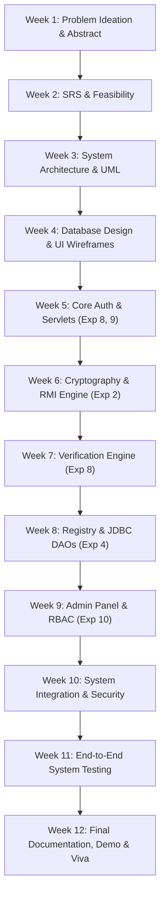

# 🛡️ DocuVerify — PBL Project Master Plan (12-Week Comprehensive Curriculum)

## 📋 Project Summary
| Field | Specification |
|---|---|
| **Project Name** | DocuVerify™ – Cryptographic Certificate Generator & Verification Portal |
| **Team ID** | 5A (PBL2627-AI&DS-A-051) |
| **Track** | Web Application — **JSP-Servlet (Apache Tomcat 9)** + Bootstrap 5 + MySQL 8.0 |
| **Faculty Guide** | Er. Ram Babu Buri (Research Area: Machine Learning & Data Science) |
| **Institution** | Arya College of Engineering & I.T., Jaipur |
| **Lab Code** | SRC-04-24 |
| **Duration** | **6 July 2026 – 6 October 2026 (12 Full Weeks)** |

---

## 👥 Team Members & Module Distribution

| # | Member | Designated Role | Core Module Owned | Lab Experiments Mapped |
|---|---|---|---|---|
| 1 | **Amit** (Team Leader) | Lead Architect & Security | 🔐 Authentication, Session & Role Security | **Exp 1** (Multithreading/Sockets), **Exp 6** (Collections), **Exp 8** (Servlets), **Exp 9** (JSP Login Validation) |
| 2 | **Ayush** | Systems & Operations | 🛠️ Admin Dashboard, User CRUD & Audit Logs | **Exp 7** (Exception Handling & File I/O), **Exp 8** (Servlets), **Exp 10** (Role-Based Mini Project) |
| 3 | **Mali** | Cryptography & Issuance | 📜 Certificate Issuance & SHA-256 Engine | **Exp 2** (RMI Remote Invocation), **Exp 5** (GUI/Dynamic Preview), **Exp 8** (Servlets) |
| 4 | **Aryan** | Verification & Validation | 🔍 Public Verification & Integrity Engine | **Exp 3** (GUI Form Inputs), **Exp 8** (Servlets), **Exp 9** (Form Validation) |
| 5 | **Ankit** | Data Architecture & Reports | 📊 Certificate Registry & JDBC Data Access | **Exp 4** (JDBC Database Connectivity), **Exp 7** (File I/O & Exports), **Exp 8** (Servlets) |

---

## 🧪 Comprehensive Lab Experiment → Project Mapping

| Lab Exp # | Experiment Title | Exact Implementation in DocuVerify | Primary Owner |
|---|---|---|---|
| **Exp 1** | Java Fundamentals & Multithreading / Socket Architecture | Concurrent request processing in Tomcat servlet threads & async task execution | Amit |
| **Exp 2** | **Remote Method Invocation (RMI)** | **`CryptoRMI.java`** / **`CryptoService.java`** — Remote cryptographic server computing SHA-256 digests over RMI registry (Port 1099) | Mali |
| **Exp 3** | Event Handling & Form Validation Components | Client-side Bootstrap form validation, live preview synchronization (`app.js`) | Aryan |
| **Exp 4** | **JDBC Database Connectivity** | **`DBConnection.java`**, **`CertificateDAO.java`**, **`UserDAO.java`**, **`AuditLogDAO.java`** — MySQL connection pooling & PreparedStatement CRUD | Ankit |
| **Exp 5** | Dynamic GUI Layouts & Real-time State | Real-time DOM reflection of certificate data on issuance page before submission | Mali |
| **Exp 6** | Java Collections Framework & String Tokenization | `HashMap`, `ArrayList<Certificate>`, and payload serialization (`rollNo|name|course|grade`) | Amit |
| **Exp 7** | Robust Exception Handling & Logging | Custom SQL error handlers, `404.jsp`, `500.jsp`, and database audit logging | Ayush & Ankit |
| **Exp 8** | **Servlet Architecture & Lifecycle** | **All 10 Servlets** (`LoginServlet`, `IssueCertificateServlet`, `VerifyCertificateServlet`, `RegistryServlet`, `AdminDashboardServlet`, etc.) | **All Members** |
| **Exp 9** | **JSP Form Validation with Error Notifications** | **`login.jsp`** & **`register.jsp`** with server-side validation messages and clean alerts | Amit |
| **Exp 10** | **Role-Based Dynamic Web Mini Project** | **DocuVerify Portal** — Complete production-grade web project with Admin and User permission boundaries enforced by `AuthFilter` | **Full Team** |

---

## 🗄️ MySQL Database Schema (docuverify_db)

```sql
CREATE DATABASE IF NOT EXISTS docuverify_db;
USE docuverify_db;

-- 1. Users Table (Amit's Module)
CREATE TABLE users (
    id INT AUTO_INCREMENT PRIMARY KEY,
    username VARCHAR(50) UNIQUE NOT NULL,
    email VARCHAR(100) UNIQUE NOT NULL,
    password_hash VARCHAR(64) NOT NULL,
    full_name VARCHAR(120) NOT NULL,
    role ENUM('admin', 'user') DEFAULT 'user',
    is_active TINYINT(1) DEFAULT 1,
    created_at TIMESTAMP DEFAULT CURRENT_TIMESTAMP,
    last_login TIMESTAMP NULL
);

-- 2. Certificates Table (Mali & Aryan's Module)
CREATE TABLE certificates (
    id INT AUTO_INCREMENT PRIMARY KEY,
    cert_id VARCHAR(20) UNIQUE NOT NULL,
    student_name VARCHAR(120) NOT NULL,
    roll_no VARCHAR(60) NOT NULL,
    course_name VARCHAR(180) NOT NULL,
    grade VARCHAR(50) NOT NULL,
    crypto_hash VARCHAR(64) NOT NULL,
    issued_by INT,
    issue_date TIMESTAMP DEFAULT CURRENT_TIMESTAMP,
    is_revoked TINYINT(1) DEFAULT 0,
    FOREIGN KEY (issued_by) REFERENCES users(id)
);

-- 3. Audit Logs Table (Ayush's Module)
CREATE TABLE audit_logs (
    id INT AUTO_INCREMENT PRIMARY KEY,
    user_id INT,
    action VARCHAR(100) NOT NULL,
    details TEXT,
    ip_address VARCHAR(45),
    created_at TIMESTAMP DEFAULT CURRENT_TIMESTAMP,
    FOREIGN KEY (user_id) REFERENCES users(id)
);

-- 4. Verification History Table (Aryan's Module)
CREATE TABLE verification_history (
    id INT AUTO_INCREMENT PRIMARY KEY,
    cert_id VARCHAR(20) NOT NULL,
    verified_by INT NULL,
    result ENUM('authentic', 'tampered', 'not_found') NOT NULL,
    verified_at TIMESTAMP DEFAULT CURRENT_TIMESTAMP,
    FOREIGN KEY (verified_by) REFERENCES users(id)
);
```

---

## 🗓️ 12-Week Master Implementation Schedule



### Week 1 (06 Jul – 12 Jul 2026): Problem Ideation, Abstract & Scope Definition
- **Amit**: Formed Team 5A, finalized guide Er. Ram Babu Buri, drafted project abstract, established Git repository.
- **Ayush**: Researched academic administrative workflows and user authorization patterns.
- **Mali**: Investigated cryptographic hashing algorithms (SHA-256) and Java RMI feasibility (**Exp 2**).
- **Aryan**: Evaluated existing online credential verification portals and document forgery issues.
- **Ankit**: Studied relational database schema requirements and JDBC best practices (**Exp 4**).
- **Deliverables**: Approved Project Abstract, Team Charter, GitHub Initial Repo.

### Week 2 (13 Jul – 19 Jul 2026): Software Requirement Specification (SRS) & Literature Review
- **Amit**: Authored SRS Section 1 (Introduction, Purpose, Scope, System Perspective).
- **Ayush**: Documented functional requirements for Admin Dashboard, user management, and audit tracking.
- **Mali**: Documented functional specifications for certificate issuance and cryptographic digest calculation.
- **Aryan**: Defined verification workflow, user inputs, and output validation states.
- **Ankit**: Compiled non-functional requirements (response time, cryptographic reliability) and hardware/software stack.
- **Deliverables**: Comprehensive SRS Document v1.0.

### Week 3 (20 Jul – 26 Jul 2026): System Architecture & UML Design
- **Amit**: Designed system-level Use Case Diagram and Class Diagram for Authentication entities (`User`, `AuthFilter`).
- **Ayush**: Created Activity Diagram for Admin CRUD actions and Class Diagram for `UserDAO` & `AuditLogDAO`.
- **Mali**: Constructed Sequence Diagram for Certificate Issuance illustrating RMI remote method invocation.
- **Aryan**: Designed Sequence Diagram for Verification workflow and hash comparison decision logic.
- **Ankit**: Drafted Entity-Relationship (ER) Diagram detailing primary/foreign key constraints and Deployment Diagram for Tomcat 9.
- **Deliverables**: Complete UML Design Specification (7 diagrams).

### Week 4 (27 Jul – 02 Aug 2026): Database Schema Modeling & UI/UX Wireframing
- **Amit**: Initialized MySQL `docuverify_db`, created `users` table schema, built wireframes for `login.jsp` & `register.jsp`.
- **Ayush**: Built `audit_logs` schema, designed wireframes for `admin_dashboard.jsp` and `manage_users.jsp`.
- **Mali**: Created `certificates` table schema, designed wireframes for `issue.jsp` and live preview card.
- **Aryan**: Designed wireframes for public `verify.jsp` including Authentic, Tampered, and Not Found states.
- **Ankit**: Configured global Bootstrap 5 color palette, typography (`Manrope`/`DM Sans`), and table layouts for `list.jsp`.
- **Deliverables**: Executable `schema.sql` and HTML/CSS mockups.

### Week 5 (03 Aug – 09 Aug 2026): Module Coding Sprint 1 — Base Setup & Auth Module (Exp 8 & 9)
- **Amit**: Implemented **`LoginServlet.java`** (POST authentication), **`login.jsp`** with field validation (**Exp 9**), and `PasswordUtil.java`.
- **Ayush**: Configured Apache Tomcat 9 server environment and basic project packaging (`web.xml`).
- **Mali**: Implemented `Certificate.java` and `User.java` POJO entity models with complete getters and setters.
- **Aryan**: Built public landing page layout (`index.jsp`) with responsive navigation and feature highlights.
- **Ankit**: Built **`DBConnection.java`** using JDBC driver manager (**Exp 4**) and verified MySQL connection pooling.
- **Deliverables**: Operational login portal with credential validation and error messaging.

### Week 6 (10 Aug – 16 Aug 2026): Module Coding Sprint 2 — Cryptographic Engine via RMI (Exp 2)
- **Amit**: Implemented **`RegisterServlet.java`** and `register.jsp` allowing self-registration with password hashing.
- **Ayush**: Built `AuditLog.java` model and initialized `AuditLogDAO.java` for action logging.
- **Mali**: Implemented **`CryptoService.java`** (Remote interface) and **`CryptoRMI.java`** computing SHA-256 over RMI registry (**Exp 2**).
- **Aryan**: Added client-side real-time form event synchronization in `app.js` for instant certificate preview (**Exp 3**).
- **Ankit**: Implemented initial `CertificateDAO.java` methods (`saveCertificate`, `getCertificateById`).
- **Deliverables**: Functional RMI cryptographic server and certificate generation logic.

### Week 7 (17 Aug – 23 Aug 2026): Module Coding Sprint 3 — Verification Engine (Exp 8)
- **Amit**: Implemented session management in `LoginServlet` and created `LogoutServlet.java`.
- **Ayush**: Added session state checks and basic activity tracking on login.
- **Mali**: Built **`IssueCertificateServlet.java`** handling certificate form submission and database persistence.
- **Aryan**: Implemented **`VerifyCertificateServlet.java`** (**Exp 8**) recalculating SHA-256 hashes on the fly and comparing against database digests.
- **Ankit**: Implemented SQL query optimization for certificate lookup by unique identifier (`cert_id`).
- **Deliverables**: Functional public verification engine proving mathematical document authenticity.

### Week 8 (24 Aug – 30 Aug 2026): Module Coding Sprint 4 — Certificate Registry & JDBC DAO (Exp 4)
- **Amit**: Built `ProfileServlet.java` and `profile.jsp` for user profile inspection and updates.
- **Ayush**: Implemented user count metrics and certificate summary counts in DAOs.
- **Mali**: Integrated issue success cards with direct one-click public verification links.
- **Aryan**: Refined `verify.jsp` visual styling, displaying student details, timestamps, and side-by-side hash comparison proof.
- **Ankit**: Built **`RegistryServlet.java`** and **`list.jsp`** (**Exp 4**) with dynamic database rendering, search filters, and status badges.
- **Deliverables**: Complete searchable certificate registry populated directly from MySQL.

### Week 9 (31 Aug – 06 Sep 2026): Module Coding Sprint 5 — Admin Panel & Role-Based Access (Exp 10)
- **Amit**: Built **`AuthFilter.java`** enforcing role-based access control (**Exp 10**), restricting `/admin/*` routes to administrators.
- **Ayush**: Built **`AdminDashboardServlet.java`**, **`ManageUsersServlet.java`**, `admin_dashboard.jsp`, and `manage_users.jsp` with user deletion and metrics.
- **Mali**: Connected admin certificate statistics and audit trail logging on certificate issuance.
- **Aryan**: Added verification logging to track public verification attempts.
- **Ankit**: Implemented user list retrieval queries and user deletion queries in `UserDAO.java`.
- **Deliverables**: Fully operational Admin Dashboard with User Management and Audit Logs.

### Week 10 (07 Sep – 13 Sep 2026): System Integration, Security Hardening & Error Handling
- **Amit**: Audited all input parameters for SQL injection prevention using `PreparedStatement` and XSS mitigation; created `404.jsp` and `500.jsp`.
- **Ayush**: Configured global error codes in `web.xml` and session expiration timeout (30 minutes).
- **Mali**: Refined RMI auto-initialization fallback inside `CryptoRMI.java` to prevent connection drops.
- **Aryan**: Tested and refined unified navigation across navbar and sidebar for logged-in and guest users.
- **Ankit**: Automated build and deployment scripts (**`build.bat`**, **`deploy.bat`**) for single-command compilation and Tomcat deployment.
- **Deliverables**: Unified, secure web application running on Tomcat 9 with zero broken links.

### Week 11 (14 Sep – 20 Sep 2026): Comprehensive Testing & Quality Assurance
- **Amit**: Conducted authentication security testing (wrong password, SQL injection payloads, session hijacking prevention).
- **Ayush**: Performed role-escalation testing verifying non-admin users cannot access `/admin/*` endpoints.
- **Mali**: Performed cryptographic stress testing generating 50+ unique certificates to verify collision-free SHA-256 hashes.
- **Aryan**: Tested tamper detection by modifying database records directly in MySQL and validating that `verify.jsp` displays "Tampered Certificate" warning.
- **Ankit**: Conducted cross-browser validation across Google Chrome, Microsoft Edge, and Mozilla Firefox at multiple viewport resolutions.
- **Deliverables**: Comprehensive Test Plan & Test Execution Results Report (100% test pass rate).

### Week 12 (21 Sep – 06 Oct 2026): Final Project Report, Presentation & Viva Voce
- **Amit**: Compiled Final Project Report (Introduction, Architecture, Lab Experiments Mapping, Security Analysis, Conclusion).
- **Ayush**: Designed PowerPoint Presentation (20 slides) covering project problem statement, architecture, demo screenshots, and team contributions.
- **Mali**: Recorded 5-minute video demonstration showcasing end-to-end certificate issuance and verification flow.
- **Aryan**: Prepared viva voce Q&A defense document covering servlets, filters, and cryptographic hash verification.
- **Ankit**: Finalized GitHub repository with comprehensive README, license, clean commit history, and setup instructions.
- **Deliverables**: Final Project Report, Presentation Deck, Video Walkthrough, and Final Viva Defense.
